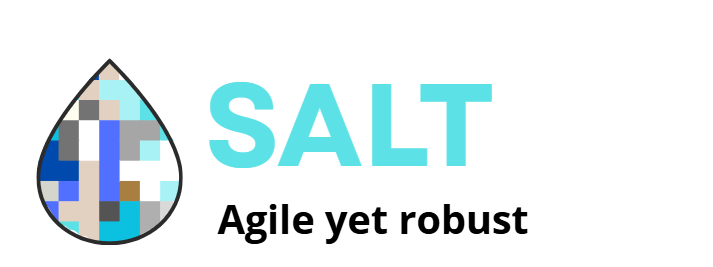

# Salt, A Scripting Langauge
<sub>Prealpha 0.0.1</sub>

---
## Approach
**Salt** is an **IN DEVELOPMENT** scripting language. With it, I want to make a language that compiles to my stack-based virtual machine, GoStack.

When I started my virtual machine in Go, I didn't expect it to be actually good, as I just wanted to use it to be less bored. But with some lat updates I did, it really leveled up, making me think "could I make a programming language that compiles to this?". And later I told myself: "just make the VM better". And so I did. In 2 days aprox. I added a lot of new operations and making it better overall.

Salt is the result of the improvements of the VM, which led me to this: the possibility of creating another language, this time an interpreted one. A scripting language.

I didn't want to overcomplicate too much, so I didn't make an AST, it goes from tokens to bytecode. This has its good and bad things as everything, but I think that design is making development easier.

## Syntax

### Output
`print("hi")` is used to generate the bytecode to print the string inside the aprenthesis.

_More syntax coming soon when it gets added_

## How To Execute
Write a file, and run
```bash
./main run main.salt
```

## Examples
In the folder `examples/` you can find examples about various Salt aspects. As the language grows, more examples will appear. 

To execute an example, run:
```bash
./main run "examples\1. Basic Output\example.salt"
```

## Changelog

### 2026-07-19
* Add first command: `print("hi")`
* Wrote README
* Now to execute write a file
* Use arguments
* Add the VM exe code
* Make it interpreted
* Refactor code
* Add examples/ folder
* Make it able to execute more than one file